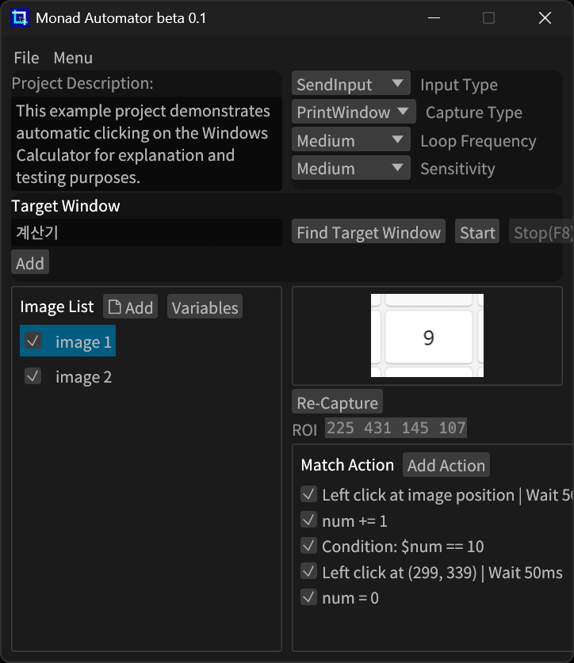
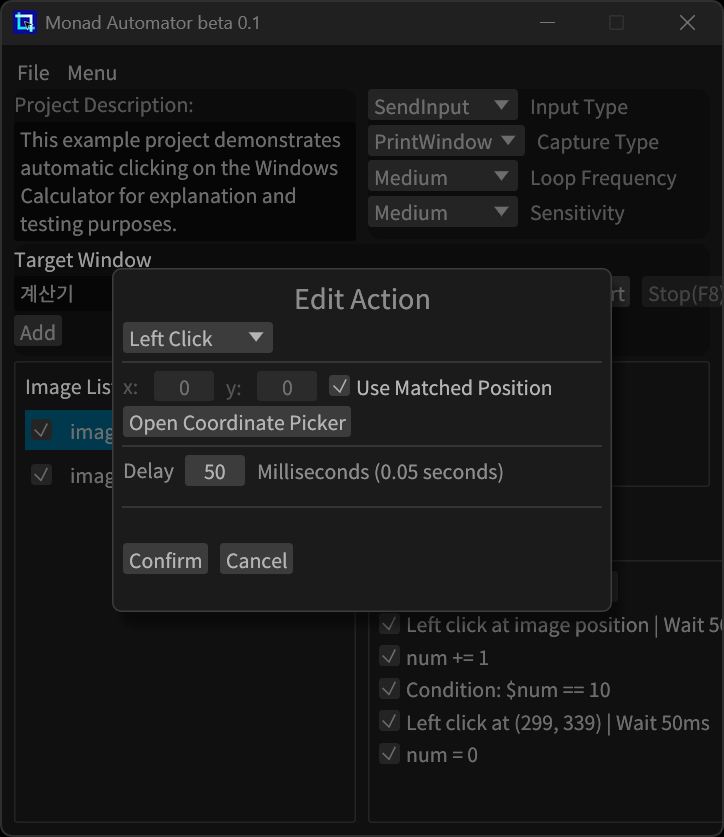
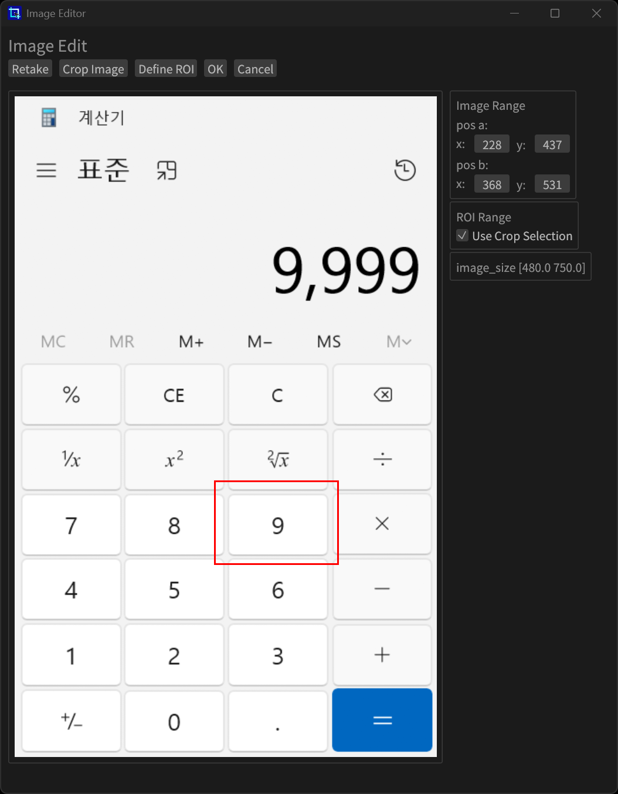

<div align="center">
  
  <h1>Monad Automator</h1>
  <h3>
    <a href="./README.md"> English </a>
    <span> | </span>
    <a href="./translations/ko-kr/README.md"> 한국어 </a>
  </h3>
</div>

**Monad Automator** is a Windows automation tool that recognizes images displayed on the screen and performs predefined actions automatically.

You can easily configure actions such as mouse clicks, key presses, and text input **without writing complex scripts**.

---

## Features

- Image-based template matching  
- Mouse click, drag, scroll, and keyboard input support  
- Variable creation and usage  
- Multi-instance execution support  
- Discord message and screenshot sending

---

### Download

1. Go to the [Releases](https://github.com/Monad-ABXY/monad-automator/releases) page  
2. Download the `mona-auto.zip` file  
3. Extract the archive  
4. Run `mona-auto.exe`

---

## Screenshots

| Main | Action Setup | Image Edit |
|------|---------------|-------------|
|  |  |  |

---

## Usage

1. Run `mona-auto.exe`  
2. Use `Find Target Window` to select the window for automation  
3. Add an image with `🗋 Add`  
4. Capture a region using `Re-Capture` to register it as a template  
5. Add an action using `Add Action`  
6. Click `Start` → When the image is detected, the corresponding actions will run automatically

---

## Build from Source

To build from source, you need to install [Rust](https://rust-lang.org/) first.

```bash
git clone https://github.com/Monad-ABXY/monad-automator
cd monad-automator
cargo build --release
```

The executable will be created at:
`target/release/mona-auto.exe`

---

## Contributing Translations

Request translation access in the following issue:
[Open Translation Access Issue](https://github.com/Monad-ABXY/monad-automator/issues/1)

---

## License

**Code:** Distributed under the [Apache License 2.0](https://www.apache.org/licenses/LICENSE-2.0)

**Logo and Branding:**  
© 2025 Jehyung Yi. All rights reserved.  
The Monad Automator name and logo are trademarks of Jehyung Yi.  
Use of the name or logo without permission is not allowed.

---

> ⚠ **Notice**
> This application is currently in **beta**, and some features may be unstable.
>
> It is designed for **Windows 11 only**, and may not function properly on other operating systems.
>
> The developer **takes no responsibility for any issues or damages** that may occur while using this software.
