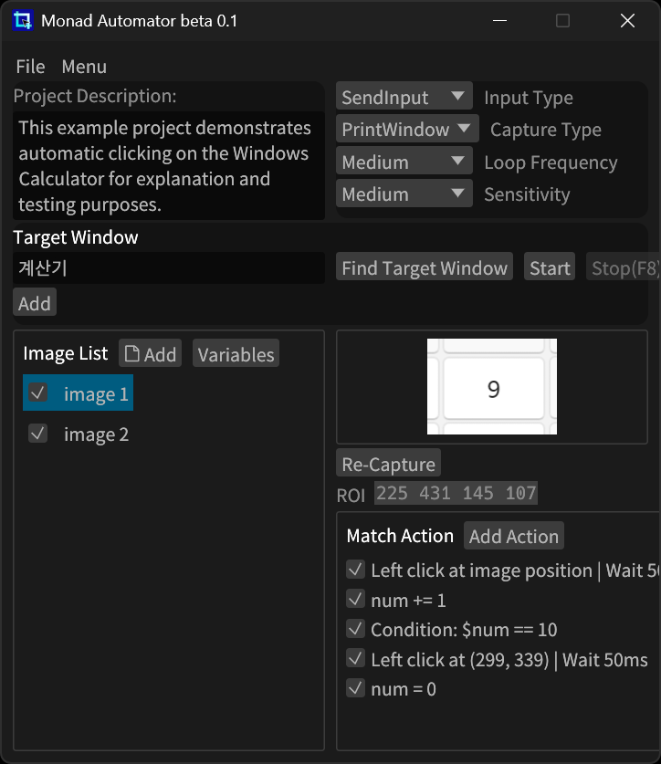
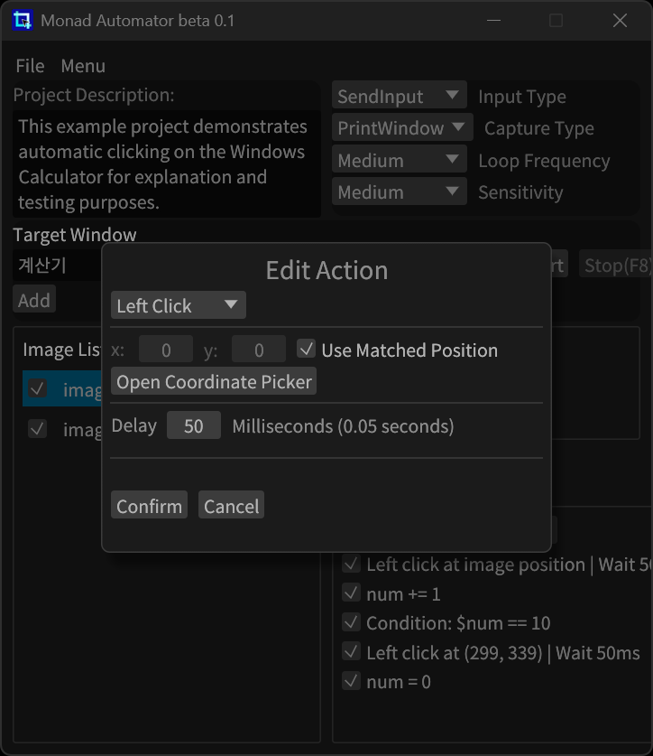

<div align="center">
  
  <h1>Monad Automator</h1>
  <h3>
    <a href="../../README.md"> English </a>
    <span> | </span>
    <a href="../ko-kr/README.md"> 한국어 </a>
  </h3>
</div>

**Monad Automator**는 화면에 표시되는 이미지를 인식하여 사전 정의된 작업을 자동으로 수행하는 Windows 자동화 도구입니다

복잡한 스크립트 없이도 클릭, 키 입력, 텍스트 입력 등의 작업을 손쉽게 설정할 수 있습니다

## 기능

- 이미지 기반 템플릿 매칭
- 마우스 클릭, 드래그, 스크롤, 키보드 입력 지원
- 변수 추가 및 사용
- 멀티 인스턴스 실행 지원
- 디스코드 메시지/스크린샷 전송 기능

---

### 다운로드

1. [Releases](https://github.com/Monad-ABXY/monad-automator/releases) 페이지로 이동
2. `mona-auto.zip` 파일 다운로드
3. 압축 해제
4. `mona-auto.exe` 실행

---

## 스크린샷

| 메인 | 액션 설정 | 이미지 수정 |
|---|---|---|
|  |  |  |

---

## 사용법

1. `mona-auto.exe` 실행
2. `대상 윈도우 찾기`로 자동화를 수행할 윈도우 선택
3. `🗋 추가`로 이미지를 추가
4. `다시 캡쳐`로 화면 영역을 캡처하여 템플릿 등록
5. `행동 추가`로 원하는 작업 추가
6. `시작` 버튼 클릭 → 이미지가 감지되면 자동으로 행동 실행

---

## 소스에서 빌드

빌드하려면 먼저 [Rust](https://rust-lang.org/)를 설치 해야합니다

```bash
git clone https://github.com/Monad-ABXY/monad-automator
cd monad-automator
cargo build --release
```

실행 파일은 다음 위치에 생성됩니다: `target/release/mona-auto.exe`

---

## 번역 기여하기

[해당 이슈](https://github.com/Monad-ABXY/monad-automator/issues/1)에 번역 권한 요청

---

## License
**Code:** [Apache License 2.0](https://www.apache.org/licenses/LICENSE-2.0) 하에 배포 됨

**Logo and Branding:**  
© 2025 Jehyung Yi. All rights reserved.  
The Monad Automator name and logo are trademarks of Jehyung Yi.  
Use of the name or logo without permission is not allowed.

---
> ⚠ **주의 사항**  
> 이 애플리케이션은 현재 개발 중인 **베타 버전**이며, 일부 기능이 불안정할 수 있습니다.
>
> **Windows 11 전용**으로 제작되었으며, 다른 운영체제에서는 정상적으로 작동하지 않을 수 있습니다.
>
> 사용 중 발생한 문제나 손해에 대해 **개발자는 어떠한 책임도 지지 않습니다**.